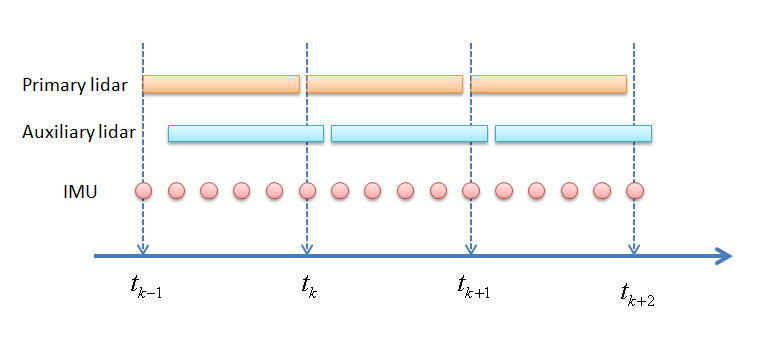
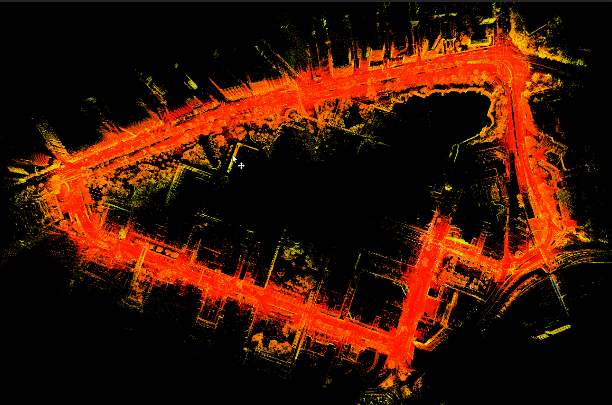
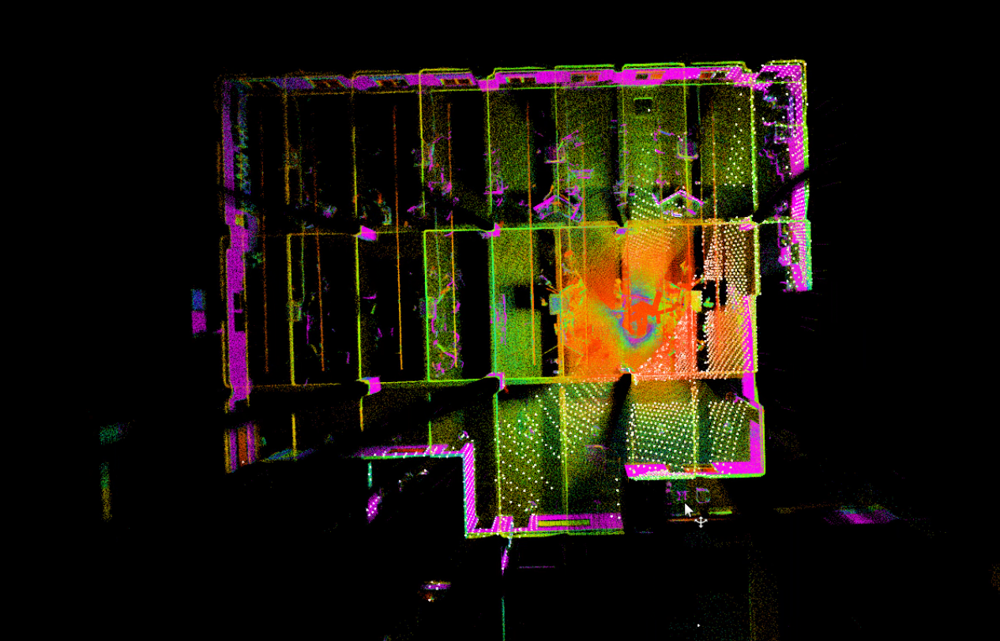
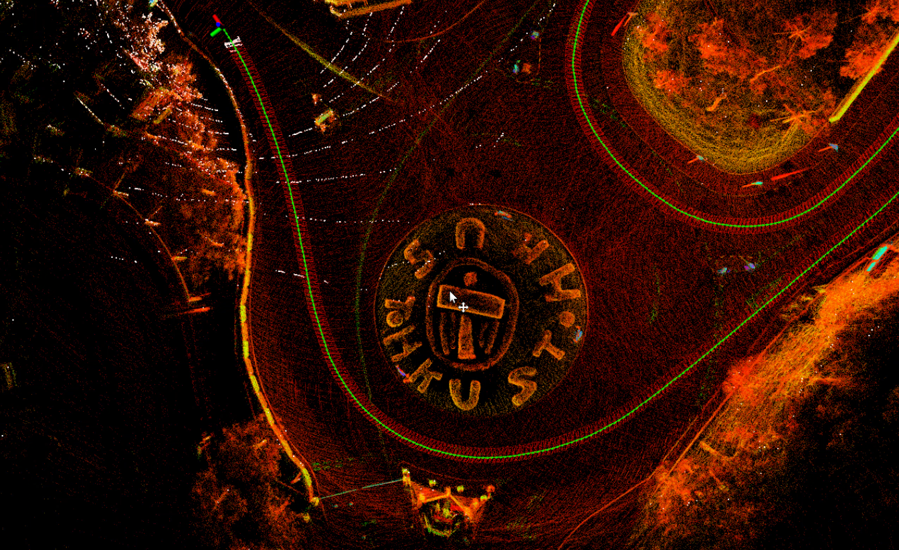

<a href="#"></img></a>
  <a href="#"></img></a>
  <a href="#"></img></a>
  <a href="#"></img></a>
  <a href="https://github.com/chengwei0427/ESKF_LIO/issues"></img></a>
  <a href="https://github.com/chengwei0427/ESKF_LIO/graphs/contributors"></img></a>

## iESKF-lio

This repository is a modified LiDAR-inertial odometry system. The system is developed based on the open-source odometry framework [**FAST-LIO**](https://github.com/XW-HKU/fast_lio) to get the odometry information. And the feature extract moudle is implemented based on [**LIO-SAM**](https://github.com/TixiaoShan/LIO-SAM) .

## Modification

  - Feature extract moudle is implemented based on lio-sam, this moudle support **multiple lidar types**(such as velodyne,ouster,robosense, livox etc.);
  - laser mapping moudle is implemented base on **fast-lio 1.0**, Use Eigen matrix instead of **IKFom**;
  - use **ikdtree** manage the map;
  - the new laser mapping moudle support **multiple lidar types**: both traditional spinning lidar (velodyne, ouster, robsense etc.) and solid-state lidar(livox);
  - add online extrinsic calib as fast-lio2
  - add new lidar process moudle, this moudle support **process multi-lidar (as one Lidar)**;

##  DEMO
**[update 2022-08-05]**

<p align="center">
  
</p>
<p align='center'>
    
    
</p>

[UrbanNav-HK-TST-20210517 test video](https://www.bilibili.com/video/BV1pS4y147Ta?spm_id_from=333.999.0.0&vd_source=438f630fe29bd5049b24c7f05b1bcaa3)

<p align='center'>
    
</p>

[Ouster32 test video](https://www.bilibili.com/video/BV1NG411h7wE?spm_id_from=333.999.0.0&vd_source=438f630fe29bd5049b24c7f05b1bcaa3)

<p align='center'>
    
</p>

[hkust_20201105full test video](https://www.bilibili.com/video/BV1FG4y1v7co?spm_id_from=333.999.0.0&vd_source=438f630fe29bd5049b24c7f05b1bcaa3)

## Dependency
Follow the [fast_lio](https://github.com/hku-mars/FAST_LIO)

## Build

Use the following commands to download and compile the package.

```
cd ~/${yourdir}/src
git clone https://github.com/chengwei0427/ESKF_LIO.git
cd ..
source devel/setup.bash
catkin_make 
```

## How to run
1. change the params in **config/feat.yaml**;
2. test direct/feature based eskf-lio use **run.launch**;
3. test **multi-lidar** slam use **run_multi.launch**;

## other notes
1. you cloud test the **multi-lidar** with the **UrbanNavDataset**;
2. the **auxiliary** lidar **only support velodyne** current, the **primary** lidar support multi-type lidars(such as velodyne,ouster,robosense, livox etc.);

## TODO

  - [ ] add ivox 
  - [x] add extrinsic parameter calibration
  - [ ] compare with FAST-LIO2
  - [x] add test video
  - [x] support multi-lidar 


## Acknowledgments
Thanks for LOAM, [FAST_LIO](https://github.com/hku-mars/FAST_LIO) ,[LIO_SAM](https://github.com/TixiaoShan/LIO-SAM) and [UrbanNavDataset](https://github.com/IPNL-POLYU/UrbanNavDataset).
